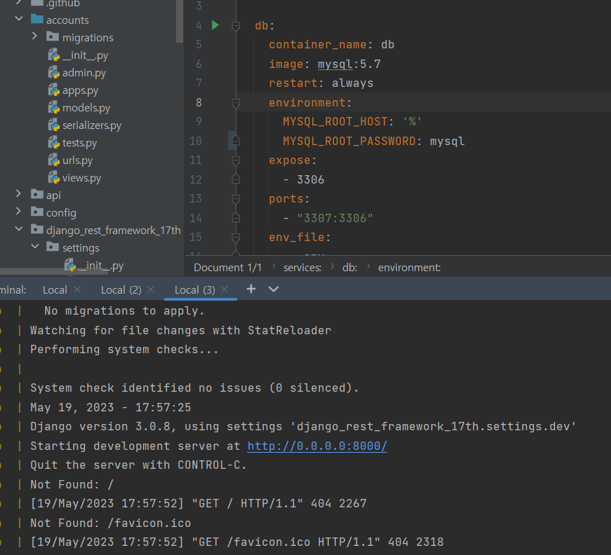
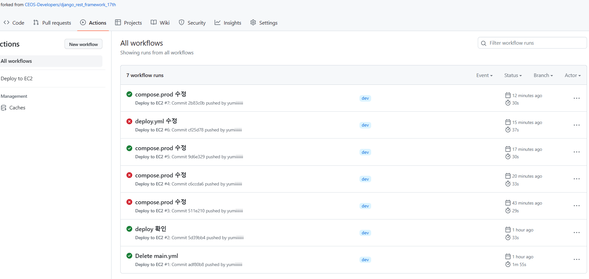

# django_rest_framework_17th
CEOS 17th Backend DRF Study

----

# 오류 해결
- 지난 과제를 처음부터 다시 했다. 이전에 했던 자료들 참고해서 다시 해봤음.
- 오류에는 두 가지 원인이 있었다.
    1. Django 버전 3.*
    2. Pillow 라이브러리 삭제
- Pillow는 이미지 처리를 위해 설치했었는데...어짜피 요새 이미지 파일은 url을 받아오는 식으로 처리한다길래 textfield로 바꿔주고 uninstall 해줬다.
- 그리고 설치한 적 없는 backports~어쩌고가 계속 오류를 일으켰는데..없어도 문제 없길래 삭제!
- 드디어 Dockerfile이 잘돌아간다....
- 
- 잘돌아가는 걸 확인했으니 github action과 EC2, RDS 인스턴스를 생성하고 .env.prod 작성...지난주에 해둠.
- github action에 연결해주었다. deploy.yml의 push branch가 dev로 되어있길래 dev branch를 새로 만들고 거기에다가 작업물을 push 해주었다.
- 
### 새로운 오류(ㅜㅜ)
- github action에서는 build가 잘 됐는데 서버에 접속은 안된다...
- 응답시간이 오래 걸리는 경우  ->  이건 내가 보안그룹 인바인드 규칙에서 포트번호 설정을 안해줬다..
- default로 생성되는 보안그룹은 개발자 포트인 22만 연결되어있음.
- 80번 추가하고...혹시 몰라서 모든 TCP도 추가해줬다.
- 또 응답시간이 오래걸릴때는...퍼블릭 DNS 주소가 바뀔때..계속 바뀌니까 해결하자
---
- 이번에는 연결 거부!!
- 진짜 오류를 모르겠어서 도움요청...
- EC2연결을 위해 https://newbiecs.tistory.com/211 를 참고하여 로컬에서 연결해주었다.
- 근데 EC2인스턴스 -> 연결 누르면 바로 연결됨...^^