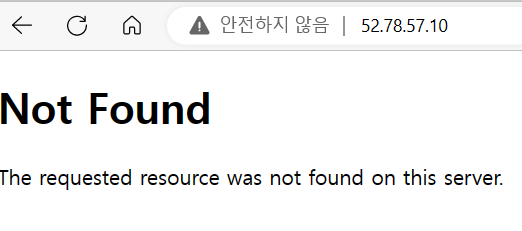
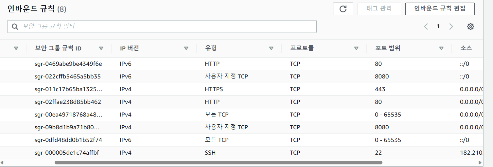

# django_rest_framework_17th
CEOS 17th Backend DRF Study

----

# 오류 해결
- 지난 과제를 처음부터 다시 했다. 이전에 했던 자료들 참고해서 다시 해봤음.
- 오류에는 두 가지 원인이 있었다.
    1. Django 버전 3.*
    2. Pillow 라이브러리 삭제
- Pillow는 이미지 처리를 위해 설치했었는데...어짜피 요새 이미지 파일은 url을 받아오는 식으로 처리한다길래 textfield로 바꿔주고 uninstall 해줬다.
- 그리고 설치한 적 없는 backports~어쩌고가 계속 오류를 일으켰는데..없어도 문제 없길래 삭제!
- 드디어 Dockerfile이 잘돌아간다....
- 
- 잘돌아가는 걸 확인했으니 github action과 EC2, RDS 인스턴스를 생성하고 .env.prod 작성...지난주에 해둠.
- github action에 연결해주었다. deploy.yml의 push branch가 dev로 되어있길래 dev branch를 새로 만들고 거기에다가 작업물을 push 해주었다.
- 
- 그리고 django_admin_log table이 이미 존재한다 어쩌구 오류도 꽤 애먹었는데...이건 이전의 docker volumns다 삭제해버림
### 새로운 오류(ㅜㅜ)
- github action에서는 build가 잘 됐는데 서버에 접속은 안된다...
- 응답시간이 오래 걸리는 경우  ->  이건 내가 보안그룹 인바인드 규칙에서 포트번호 설정을 안해줬다..
- default로 생성되는 보안그룹은 개발자 포트인 22만 연결되어있음.
- 80번 추가하고...혹시 몰라서 모든 TCP도 추가해줬다.
- 또 응답시간이 오래걸릴때는...퍼블릭 DNS 주소가 바뀔때..계속 바뀌니까 해결하자
---
- 이번에는 연결 거부!!
- 진짜 오류를 모르겠어서 도움요청...
- EC2연결을 위해 https://newbiecs.tistory.com/211 를 참고하여 로컬에서 연결해주었다.
- 근데 EC2인스턴스 -> 연결 누르면 바로 연결됨...^^
- 여기서 여러 오류원인들을 확인할 수 있다.
    - netstat -> 연결된 port 확인...근데 사실 봐도 잘 모르겠당
    - sudo docker ps -> container 확인
- docker build가 제대로 되지 않았다!!! 바로 **sudo docker-compose -f /home/ubuntu/srv/ubuntu/docker-compose.prod.yml up --build**
- 근데 이렇게 하면 502 nginx error가 뜬다..^^
- 그리고 연결이 되니까 github action에서 build가 실패함 -> 이유는 requirements.txt에 gunicorn이 없는거...
- pip install gunicorn 후 다시 push
- .env.prod의 HOST=*로 해서 탄력적 ip로 접속 가능하게 했다.
- 드디어 성공~~
- 
---
## 참고 사이트
- [netstat 명령어](https://m.blog.naver.com/PostView.naver?isHttpsRedirect=true&blogId=ncloud24&logNo=221388026417)
- [UTF-8](https://yeonyeon.tistory.com/167)
- 이거 설정 안하면 한글 입력이 안된다. 나중에 꼭 수정하기
---
# 본격적인 6주차 과제!!
1️⃣ 도메인 구입 - 가비아 + 2️⃣ Certificate Manager
- 결제가 귀찮아서 무료 사이트들을 이용하려 했는데...요청이 너무 오래걸려서 포기하고 가비아에서 샀다.
- [무료사이트](https://xn--220b31d95hq8o.xn--3e0b707e/) -> 그래도 가입해뒀으니까 잊지 않기...
- **ym-ceos.store** 할인하는 걸루 샀다!
- [가비아연결](https://developer-ping9.tistory.com/320)
- 여기서 하라는대로 네임서버 등록까지 완료
- 레코드 유형 **A~~** 선택 후 추가해주어야 한다.
- 이거 못보고 지나쳐서 시간 버렸음.

3️⃣ Elastic Load Balancer 등록
- 여기서 중요한 점...SSL/TLS 등록하는 부분이 없어서 당황했는데 port 번호 옆 HTTPS로 바꿔주기!!
- AWS...너무 보기 불편해ㅜㅜ

4️⃣ 80번 포트로 들어오는 요청은 Redirect, 443번 포트로 들어오는 요청을 인스턴스로 연결해준다.
- 완료!!
- nginx 리다이렉션 로직 추가 -> 하고 싶었는데...오류가 너무 무서워서 못하는 중임 누군가 멋지게 성공하겠지..?

5️⃣ 등록한 로드밸런서를 AWS Route 53의 도메인의 레코드에 등록한다.
- 기존에 만들어준 레코드를 수정하기!
- 별칭 on 으로 해야지 ALB등록 가능

6️⃣ ec2 인바운드 규칙 443 추가
- 
- 규칙 추가함.
- 화나서 이것저것 추가했다. 나중에 정리해야지~~
---
## 과제
- 500 error...왤까...
- 검색해보니까 Nginx오류면 Nginx error 라고 뜨는데 그러면 나는 RDS나...web문제인가...
- postman 좋나요?? insomnia쓰고 있는데 옮겨야될듯하나봐요...
 
