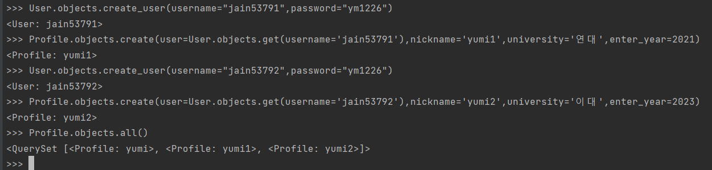
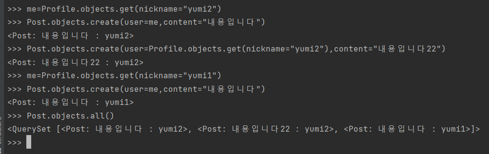
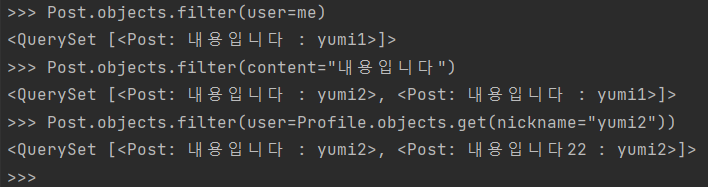
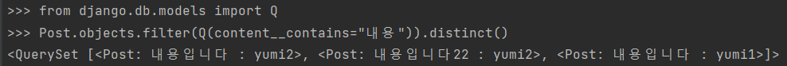
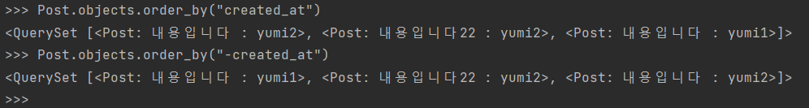
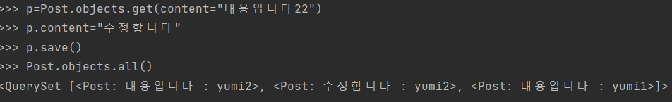
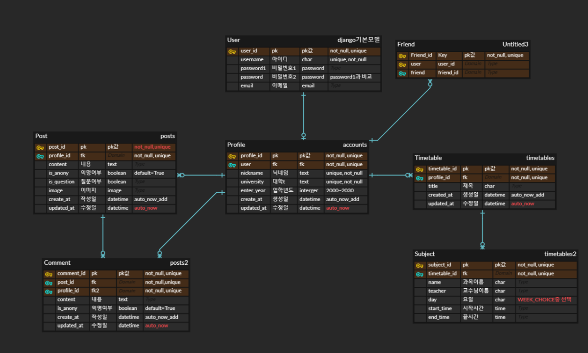

# CEOS 17기 백엔드 스터디

<<<<<<< HEAD
## CBV로 API 만들기


0️⃣ serializrs.py
```
class CommentSerializer(serializers.ModelSerializer):
    user = serializers.ReadOnlyField(source = 'user.nickname')
    class Meta:
        model=Comment
        fields=['id','user','post','content','is_anony','created_at','updated_at','reply']


class PostSerializer(serializers.ModelSerializer):
    user = serializers.ReadOnlyField(source='user.nickname')
    comment = CommentSerializer(many=True, source='comments', read_only=True) #source=model의 related_name 명시해야 보임

    class Meta:
        model = Post
        fields = ['id', 'user','content','is_anony','is_question','image','created_at', 'updated_at','comment']
 ```
 - user는 현재 로그인한 값을 받아와야 하므로 함수에서 따로 작성해주고, serializer에서는 ReadOnlyField를 이용해서 정의했다. 
 - source = user.nickname으로 표현하여서 nickname이 보인다.
 - comment라는 외부키를 가져오기 위해 CommentSerializer를 먼저 만들고, PostSerializer에서 comment라는 이름으로 참조했다.
 - 1:N 이므로 many=True, post에서는 건드려서는 안되므로 read_only=True 조건을 걸었다.
 - Post 데이터를 불러올 때 comment가 안보여서 찾아보니, source="related_name"을 작성해주어야 보인다. model하고 관련이 있어서 그런가...
 
 
1️⃣ 모든 데이터를 가져오는 API 만들기
```
# views.py
class PostList(APIView):
    def get(self, request, format=None):
        post=Post.objects.all()
        serializer=PostSerializer(post, many=True)
        return Response(serializer.data)

    def post(self, request, format=None):
        serializer=PostSerializer(data=request.data)
        if serializer.is_valid():
            serializer.save(user=self.request.user.profile)
            return Response(serializer.data, status=status.HTTP_201_CREATED)
        return Response(serializer.errors, status=status.HTTP_400_BAD_REQUEST)
        
# urls.py
  path('comment/<int:comment_id>/', CommentDetail.as_view()),
  
# 결과
[
    {
        "id": 2,
        "user": "yumi3",
        "content": "수정",
        "is_anony": true,
        "is_question": false,
        "image": null,
        "created_at": "2023-04-01T22:05:45.604023+09:00",
        "updated_at": "2023-04-07T16:13:53.083834+09:00",
        "comment": [
            {
                "id": 1,
                "user": "yumi",
                "post": 2,
                "content": "sad",
                "is_anony": true,
                "created_at": "2023-04-03T20:03:55.204582+09:00",
                "updated_at": "2023-04-03T20:03:55.204582+09:00",
                "reply": null
            },
            {
                "id": 2,
                "user": "yumi",
                "post": 2,
                "content": "asd",
                "is_anony": true,
                "created_at": "2023-04-03T20:04:04.532118+09:00",
                "updated_at": "2023-04-03T20:04:04.532118+09:00",
                "reply": 1
            }
        ]
    },
    {
        "id": 5,
        "user": "yumi",
        "content": "112",
        "is_anony": true,
        "is_question": false,
        "image": null,
        "created_at": "2023-04-07T16:42:31.082424+09:00",
        "updated_at": "2023-04-07T16:47:41.146153+09:00",
        "comment": []
    }
]
```
- post객체를 전부 가져오고, PostSerializer를 이용해 JSon형식으로 변환한 후 return한다.
- PostList CBV 함수에서는 pk값이 필요없는 기능들을 구현하였다.
- serializer는 유효성 검사를 지원해주어 is_valid()함수를 이용하였고, status를 import 하여 적절한 상태코드를 반환할 수 있도록 했다.
- 특히 save()함수는 user값에 현재 로그인한 유저의 profile정보가 들어가도록 재정의하였다.


2️⃣, 3️⃣, 4️⃣ 특정 데이터 관련 API
```
# views.py
class PostDetail(APIView):

    def get_object(self, post_id):
        try:
            return Post.objects.get(pk=post_id)
        except Post.DoesNotExist:
            raise status.HTTP_404_NOT_FOUND

    def get(self, request, post_id, format=None):
        post=self.get_object(post_id)
        serializer=PostSerializer(post)
        return Response(serializer.data)

    def put(self, request, post_id, format=None):
        post = self.get_object(post_id)
        serializer=PostSerializer(post, data=request.data)
        if serializer.is_valid():
            serializer.save()
            return Response(serializer.data, status=status.HTTP_201_CREATED)
        return Response(serializer.errors, status=status.HTTP_400_BAD_REQUEST)

    def delete(self, request, post_id, format=None):
        post = self.get_object(post_id)
        post.delete()
        return Response(status=status.HTTP_204_NO_CONTENT)
        
# urls.py 
  path('<int:post_id>/', PostDetail.as_view()),
  
  
# 결과 
{
    "id": 2,
    "user": "yumi3",
    "content": "수정",
    "is_anony": true,
    "is_question": false,
    "image": null,
    "created_at": "2023-04-01T22:05:45.604023+09:00",
    "updated_at": "2023-04-07T16:13:53.083834+09:00",
    "comment": [
        {
            "id": 1,
            "user": "yumi",
            "post": 2,
            "content": "sad",
            "is_anony": true,
            "created_at": "2023-04-03T20:03:55.204582+09:00",
            "updated_at": "2023-04-03T20:03:55.204582+09:00",
            "reply": null
        },
        {
            "id": 2,
            "user": "yumi",
            "post": 2,
            "content": "asd",
            "is_anony": true,
            "created_at": "2023-04-03T20:04:04.532118+09:00",
            "updated_at": "2023-04-03T20:04:04.532118+09:00",
            "reply": 1
        }
    ]
}
```

- get_object 함수를 class 내에 정의하여 pk값을 받으면 해당하는 객체를 반환하고, 없으면 404 error를 반환한다.
- GET, PUT, DELETE 모두 정상적으로 작동한다.
- 실제로 PUT이 정상적으로 실행되면 201 상태코드와 수정한 serializer.data를 return한다.
[44]

----

### CBV함수를 구현할 때, user와 관련해서 많은 오류를 겪었다.
- 처음 내가 생각한 기능은, profile을 생성하는 동시에 username과 password도 전달하여 django의 기본모델인 user가 one-to-one으로 바로 생성되게 하는 것이였다.
- 그러나 그 기능을 구현하기 어려워, user와 profile을 따로 생성하기로 했다.
- 여기서 문제점은, profile에서 참조하는 user를 찾는 것이였다. 따로 생성하다보니 profile이 참조하는 user를 찾는 것이 어려웠다.
- 구글링을 해보니, models.py에서 user가 created요청이 들어오면 해당 user를 참조하는 profile을 만드는 함수를 정의할 수 있었다.
- 이 방식으로 profile을 동시에 만들어 주었다. 다만, 처음 만들어질때는 profile의 data가 없으므로 모델 필드에 blank=True, null=True 설정을 해주었다.
- 따라서 profile은 POST와 DELETE기능을 따로 만들지 않았다.
- on_delete=models.CASCADE이므로 user가 삭제되면 profile이 삭제된다.
- profile은 user가 만들어질 때 함께 만들어진 profile의 id값으로 특정 데이터를 가져와 PUT 메소드가 가능하다.
- 또, username과 nickname은 중복이 안되도록 만들었는데 이 부분은 serializer에서도 구현을 해주었다. 같은 기능도 model, serializer, view 등 어디서 구현할지 고민하고 여러 방식으로 시도해보는 것도 좋은 것 같다.
[55]

```
# models.py
@receiver(post_save, sender=User)
def create_user_profile(sender, instance, created, **kwargs):
    if created:
        Profile.objects.create(user=instance)


@receiver(post_save, sender=User)
def save_user_profile(sender, instance, **kwargs):
    instance.profile.save(
```

---

## Viewset으로 코드 리팩토링하기
```
# views.py
class PostViewSet(viewsets.ModelViewSet):
    queryset=Post.objects.all()
    serializer_class=PostSerializer

    def perform_create(self, serializer):
        serializer.save(user = self.request.user.profile)
        
# urls.py
app_name = 'posts'
router = DefaultRouter()

router.register('post', PostViewSet) #comment list볼러면 설정해줘야함..
router.register('comment',CommentViewSet)

urlpatterns = [
    path('', include(router.urls)),
] + static(settings.MEDIA_URL, document_root=settings.MEDIA_ROOT)
```
- 코드가 완전 간단하게 줄어든다!
- perform_create로 serializer의 save 메소드를 재정의할 수 있다. user에 따로 저장하기 위해 재정의했음.
- 처음에는 PostViewSet을 불러올 때 ''로 url을 설정하지 않았는데, 그러면 CommentViewSet을 불러올 때 url을 알아보지 못한다.
- 추가로 viewset을 쓰고 싶다면 url은 등록해주는 것이 좋다.

---

## user 관련 기능
- user와 관련된 기능은 viewset으로 한번에 하기에는 확장이 어려워 CBV 방식으로 그대로 구현하였다.
- 또한 login, logout 기능을 구현했다. django 에서 기본으로 제공하는 auth 함수를 이용하였다.
- Response에 serializer.data를 그냥 넣으면 입력하는 칸에도 data를 return해서 불편함이 있다. 그럴때에는 {'data':serializer.data} 이런 식으로 하면 json형식으로 결과창에 return 한다.
- user 기능을 확장해서 token을 발행해 관리하거나, 권한 관리도 가능할 것이다. 시간이 나면 여기에 도전해야지...


---

## filter 기능
- 하나 이상의 메소드를 이용하라는 게 어떤 말인지 모르겠다...
- pip install django-filter 설치 후 post에서 filter 기능이 잘 되는 것은 확인했다.
- 만약 filter하고 싶은 내용에 외부키가 존재한다면, search_fileds=['외부키__필드이름'] 이런식으로 설정해야 오류가 안난다.
- 
=======
---
외부 데이터베이스는 처음 써봐서 신기했다. shell에서 데이터베이스를 열고 django-admin 페이지에 가지 않아도 데이터를 가지고 활용할 수 있어 편리했다.
데이터를 다루는 여러 명령어가 있는데, 이중에서 내가 지금 쓸 수 있는 것들로만 사용해봤다.
- 모델명.objects.all() : 모델의 모든 객체 조회
- 모델명.object.create(필드=필드값, ...) : 모델 객체 생성, 모델 옵션들에 주의!!
- 모델명.object.get(필드=필드값) : 모델 값 반환, 하나의 값만 반환한다.
- 모델명.object.filter(필드=필드값) : 모델 값 검색!
아래는 활용 결과들
1. user를 만들고, 그에 맞는 profile을 만들었다. post 객체가 user가 아닌 이를 상속받는 profile을 참조하기 때문에...만들어야함.

2. me라는 변수에 profile을 저장하고, 이를 이용해 post 객체를 만들었다.

3. filter기능을 활용했다. 일부만 검색해도 일치하면 다 나오도록 만들고 싶었는데, 그렇게 하려면 django에서 제공하는 변수 Q를 이용해서 filter를 적용하면 된다.



4. 이외에도 자주 쓰일 것 같은 orm 정렬, 수정, 삭제 등을 써봤다.




---
### accounts
accounts 앱에서는 user model을 일대일로 참조하는 Profile 모델과 친구 맺기 기능을 위한 Friend 모델을 만들었다.
```
class Profile(models.Model):
    user = models.OneToOneField(User, on_delete=models.CASCADE, related_name='profile')
    nickname = models.TextField(max_length=10, unique=True)
    university = models.TextField(max_length=16)
    enter_year = models.IntegerField(validators=[MinValueValidator(2000), MaxValueValidator(2030)])
    created_at = models.DateTimeField(auto_now_add=True)
    updated_at = models.DateTimeField(auto_now=True)

    def __str__(self):
        return f'{self.nickname}'
 ```
 enter_year는 입학년도 값인데, 구간 설정을 위해 from django.core.validators import MinValueValidator, MaxValueValidator를 이용했다.
 
 
 친구 맺기 기능에서 많이 해맸다. 내가 생각한 것은 현재 나의 profile정보와 친구의 profile정보를 둘다 저장하는 Friend모델을 만드는 방법이였다.
 ```
  class Friend(models.Model):
    user = models.ForeignKey(Profile, on_delete=models.CASCADE, related_name='friends')
    friend = models.ForeignKey(Profile, on_delete=models.CASCADE)

    def __str__(self):
        return f"{self.user.nickname}"
 ```
 다만, 중복저장이 문제였다ㅜㅜㅜ
 if문으로 현재 나의 Friend객체에 있는 값들을 비교하고 싶은데, 두 값을 동시에 비교하는 것이 어려웠다. 게다가 둘다 Profile객체로 받아오니 굉장히 헷갈렸다....
 아직도 해결을 못했다. 방법을 알려주세요..
 ```
 def new_friend(request, profile_id):
    me = request.user.profile
    friend = get_object_or_404(Profile, pk=profile_id)
    new_friend=Friend()
    new_friend.user=me
    new_friend.friend=friend
    new_friend.save()
    return render(request, 'accounts/home.html')
 ```
 문제의 코드...참고로 profile_id값은 내가 아닌 다른 사람의 값이다.
 
 ---
 ### posts
 Post와 Comment를 구현하면서 html로부터 값을 받아오는 법을 새롭게 알게 됐다.
 그동안 html은 거의 구현하지 않았는데, 굉장히 많은 type이 있어 받아오기가 쉬웠다. 심지어 date, time도 별도로 있다! 
 그리고 checkbox를 이용해 True값이나 False값을 저장하는 법을 찾았다. 
 ```
 def create(request):
    me=request.user.profile
    if request.method == "POST":
        new_post=Post()
        new_post.content=request.POST['content']
        new_post.user = me
        if len(request.POST.getlist('is_anony')) == 0:
            new_post.is_anony = False
        else:
            new_post.is_anony = True
        if len(request.POST.getlist('is_question')) == 0:
            new_post.is_question = False
        else:
            new_post.is_question= True
        new_post.image=request.FILES['image']
        new_post.save()
        return redirect('posts:home')
    return render(request, 'posts:home')
```
에브리타임은 익명과 질문글을 선택하는 기능이있어 booleanfield를 적극 활용했다.

---
### timetables
시간표를 어떻게 구현할까 고민하다가 댓글과 비슷하게 만들기로 했다.
시간표(timetable)모델과 이를 1:N으로 참조하는 과목(subject)모델을 만들었다.
```
day:
<br>
    <input type="radio" value="Monday" name="day"> Monday
    ~~
    <input type="radio" value="Sunday" name="day"> Sunday
<br>
end_time:
<br>
    <input name="end_time" type="time">
<br>
```
 이번에는 radio type을 이용하였다. Subject모델의 week가 내가 만든 WEEK_CHOICE에서 선택하도록 만들었기 때문에, 혹시 오타로 잘못 입력하면 귀찮아져서...
 또, time type을 이용했다. 다만 이런 type들을 사용할때 request.POST에서 잘못인식하고 오류를 일으킬 수 있다. 그럴때는 reqeust.POST.get('~')으로 받아온다.
 
 ---
 ### ERDCloud
 

 ---
 ### 자잘한 오류들 및 참고
 - database를 건드리다가 돌이킬수없는 실수를 했다...
 drop database 'DB명' 으로 database 삭제 후 다시 migrate 해줌.
 - 가상환경에서 django가 제대로 설치됐는지 확인하기
 django가 써져 있어 설치된 줄 알았는데 아니였다. package 두 번 클릭하니 설치가 됐다..
 - 환경변수 설치하는 라이브러리는 ~~environ~~django-environ
 - html 건드리면서 참고한 사이트
 [html type 정리] (http://www.tcpschool.com/html-input-types/number)
 -readme는 파일명에 띄어쓰기 인식을 못하나?? images 이름 수정해야됐음.
 
 ---
 ### 회고...느낀점...
 어렵다...그치만 재밌다...shell도 새로 써봐서 이것저것 만져보고, 주어진 기능을 어떻게 구현할 지 계속 고민하였다. 조금 이상하게 구현된 것도 있지만...다른 사람들은 어떻게 해결했을지도 궁금하다. 
 
 시간이 조금 부족했던 점이 아쉽다. html도 좀 멋있게..에브리타임처럼 만들고 싶었는데 기능 구현하기만해도 바빠서 그냥 알아볼 수 있을 정도만 구현했다ㅜ
 
 django에서는 form 기능을 제공해서 내가 모델을 수정해도 다른 함수들을 편하게 구현할 수 있다. 하지만 form으로 하면 html이 좀..안예쁘다...그리고 자잘한 기능들을 계속확인하려고 일부러 form 활용을 안했는데...form을 사용하면서 view를 자유롭게 다루는 것이 가능한가?? 아직 그것까지는..배운게없어서 모르겠다.

 
 
 
>>>>>>> 2d9b0b226879a30ce158ec64d0922cfab30ed2ec
