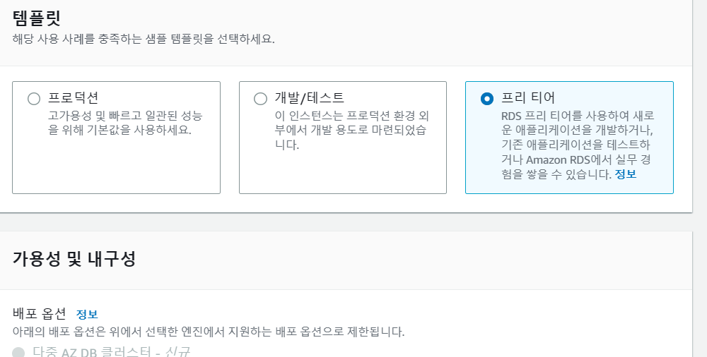
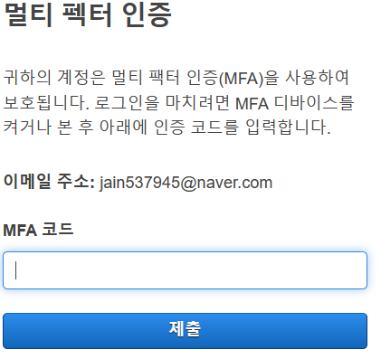

# CEOS 17기 백엔드 스터디

------
## 오류 해결과정(해결은 못했지만...)

```
#0 47.65   ERROR: Failed building wheel for Pillow
#0 47.65   Running setup.py clean for Pillow
#0 48.12 Failed to build backports.zoneinfo Pillow
#0 48.12 ERROR: Could not build wheels for backports.zoneinfo which use PEP 517 and cannot be installed directly
#0 48.15 WARNING: You are using pip version 20.1.1; however, version 23.1.2 is available.
#0 48.15 You should consider upgrading via the '/usr/local/bin/python -m pip install --upgrade pip' command.
```
- 내가 설치한 라이브러리들이랑 실행하기 위한 장치들의 버전이 낮아서 생기는 문제들 갔다...
- 계속해서 업데이트를 진행해주었는데 계속 같은 오류가 떠서 문제 였는데 알고보니까 Dockerfile의 컨테이너를 실행할 때 버전 업그레이드를 해줘야 하는 문제였다.
```Dockerfile
RUN pip install --upgrade pip setuptools wheel
```
----
- 계속 오류가 뜨는데 용량과 windows와 mac의 차이로 생기는 오류 같아서...인터넷에 나온 방식으로 바꿔봤다.
```Dockerfile
#FROM python:3.8.3-alpine
FROM python:3.8.3-slim-buster

#RUN apk add --no-cache mariadb-connector-c-dev
#RUN apk update && apk add python3 python3-dev mariadb-dev build-base && pip3 install mysqlclient && apk del python3-dev mariadb-dev build-base
```
- 또 apk는 mac용(??)이라고 해서 저부분도 주석처리했다.
---
- mysqlclinet가 설치가 안된다.
```
ERROR: Could not find a version that satisfies the requirement libmysqlclient-dev (from versions: none)
ERROR: No matching distribution found for libmysqlclient-dev
```
- 이를 해결하기 위한 방식으로 sudo 명령어를 Dockerfile에 입력해주어야 하는데, window에서는 sudo 명령어를 사용하려면 따로 처리를 해주어야 한다....
- 어짜피 컨테이너에서 실행만 해주면 되니까 Dockerfile에 sudo명령어를 실행시킬 수 있도록 작성함.
```Dockerfile
RUN apt-get update && apt-get install -y sudo
RUN adduser --disabled-password --gecos "" user  \
    && echo 'user:user' | chpasswd \
    && adduser user sudo \
    && echo 'user ALL=(ALL) NOPASSWD:ALL' >> /etc/sudoers
RUN apt-get -y install python3-dev default-libmysqlclient-dev build-essential

RUN sudo apt-get install python3-dev default-libmysqlclient-dev build-essential
```
- sudo 명령어 처리 후 mysqlclient 설치하기.
- 또  뭐 계속하겠냐는 질문에 자동으로 y처리 되도록 설정함.
- 근데 너무 오래걸린다...저 부분에서만 130s임 이거 맞나..?
---
- No module named 'environ' 에러 -> pip install environ 후 requirements.txt에도 추가함.
-  raise ValueError, "No frame marked with %s." % fname
- pip install environ이 안된다함. 대신 pip install django-environ으로 바꿔줌.
---
- django.db.utils.OperationalError: (1049, Unknown database CEOS_DB) 오류 -> docker-compose의 database name을 .env파일과 맞춰야하는 줄 알았는데...아닌가보다...mysql로 해줬다.
- django.db.utils.OperationalError: (1045, "Access denied for user 'root'@'localhost' (using password: YES)") -> password는 내가 설정한 걸로 해주기
- django.db.utils.OperationalError: (1050, "Table 'django_admin_log' already exists") 
- 여기서 막혔다...모든 database의 django_admin_log table을 삭제했는데 우째서 계속 존재한다고 뜰까...
- 오류가 너무 많아서 처음부터 다시 해야 할 듯 하다...
---
## AWS 배포



- 생성은 과제를 따라 해주었다.
- 하다가 주의할 점...템플릿 프리티어로 설정하기...기본 설정이 프로덕션이였는데 못보고 지나칠뻔함

---
### MFA 설정
- 오류가 너무 많아서 AWS 연결 시도도 못해봤다...
- 대신 보안을 위한 MFA를 설정해주었다. 미리 보안 예방
- MFA는 IAM에서 추가할 수 있다. IAM은 역할에 따른 사용자를 구분하고 설정하는 걸로만..간단하게 알고 있어는데 루트사용자에 대한 보안 관리도 하는 줄은 몰랐다.

- **Authenticator** 앱을 사용해 로그인할 때마다 계속 갱신되는 코드를 입력한 후 계정에 접속할 수 있다.
---
## 회고
- 오류가 너무 많이 나서...오류 하나를 해결하면 새로운 오류가 2개가 나온다...
- 계속해서 오류를 고치다가 처음 셋팅에서 너무 많이 벗어나고, 끝이 없어보여 아예 처음부터 다시 해봐야 할 듯하다..ㅜㅜ
- 너무 아쉬움이 많은 과제입니다...
